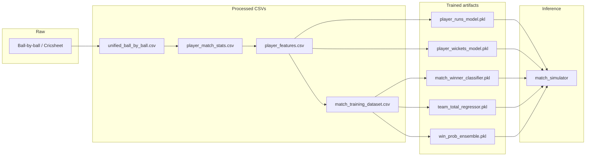

# IPLpred — Sabermetric-style IPL match prediction

This repository builds **player-level** and **team-level** models from historical ball-by-ball data, then runs a **match simulator** to produce pre-match predictions: win probability, top batters/bowlers, and a composite “player of the match” score. A small **FastAPI** web app (read-only) displays the prediction log and **pred vs actual** from `data/processed/prediction_log.csv`; pre-match runs use the CLI.

---

## How to use this README (template)

| Section | What you’ll find |
|--------|-------------------|
| [Quick start](#quick-start) | Minimal commands to run data → train → predict |
| [End-to-end pipeline](#end-to-end-pipeline) | Order of operations and what each stage produces |
| [Repository map](#repository-map) | What each file/folder is for |
| [Mathematical reference](#mathematical-reference) | Formulas and design choices in one place |
| [Web app](#web-app) | Running the UI and APIs |
| [Models on disk](#models-on-disk) | What each `.pkl` contains |

---

## Quick start

```bash
# From repo root (Python 3.10+ recommended)

# 1) Build processed tables (large; run when raw data changes)
python build_unified_dataset.py      # or iplpred.pipeline.build_unified_dataset
python build_player_match_stats.py   # merges ICC WC key scorecards when present
python build_features.py
python scripts/build_player_registry.py        # v1: registry + player_aliases.csv (merges player_aliases_seed.csv)
python scripts/build_player_identity.py        # player_identity + squad_stats_bridge for squad validation
python scripts/fill_player_feature_priors.py   # median priors for squad players still missing from features
python scripts/build_player_registry.py        # v2: pick up newly added prior player_ids
python scripts/build_player_identity.py        # v2: refresh bridge after priors
python build_training_dataset.py

# Or: make build-all

# 2) Train models
python train_player_model.py
python train_match_winner_model.py
python train_team_total_model.py
python train_win_prob_ensemble.py    # optional: ML vs sim weights + calibration

# 3) Predict a fixture (11 vs 11 player_ids as in player_features.csv)
python predict_match_outcomes.py --team1-name "..." --team2-name "..." \
  --xi1 "id1,id2,..." --xi2 "id1,id2,..." --sims 200 --venue "M Chinnaswamy Stadium, Bengaluru"

# 4) Web UI (optional)
pip install -r requirements-web.txt
uvicorn web.dashboard:app --reload --host 0.0.0.0 --port 8000
```

See `DAILY_WORKFLOW.txt` for per-match logging and retraining notes.

---

## End-to-end pipeline



1. **Unified dataset** — one table of deliveries with batter/bowler, runs, wickets.  
2. **Player match stats** — per player, per match: runs, balls, wickets, role, etc.  
3. **Player features** — rolling form, venue history, matchup SRs, … (see `FEATURE_COLS` in training code).  
4. **Match training dataset** — one row per match: team aggregates + winner label.  
5. **Training scripts** — fit regressors/classifiers and save under `models/`.  
6. **Simulator** — for a given pair of XIs, combine models + rules → predictions.

---

## Repository map

### Root entrypoints (thin wrappers)

These usually call into `iplpred/` so you can run `python train_player_model.py` from the repo root.

| File | Role |
|------|------|
| `build_unified_dataset.py` | Delegates to pipeline that builds `data/processed/unified_ball_by_ball.csv`. |
| `build_player_match_stats.py` | Aggregates to `player_match_stats.csv`. |
| `build_features.py` | Builds `player_features.csv` (rolling / venue / matchup features). |
| `build_training_dataset.py` | Builds `match_training_dataset.csv` (match-level rows + winner). |
| `train_player_model.py` | Trains RandomForest runs + wickets models → `models/player_*_model.pkl`. |
| `train_match_winner_model.py` | Trains calibrated team winner classifier → `match_winner_classifier.pkl`. |
| `train_team_total_model.py` | Trains Ridge team total regressors → `team_total_regressor.pkl`. |
| `train_win_prob_ensemble.py` | Learns blend + optional isotonic calibration → `win_prob_ensemble.pkl`. |
| `match_simulator.py` | CLI wrapper around `iplpred.match.match_simulator`. |
| `predict_match_outcomes.py` | CLI for six pre-match outcomes (winner, best bat/bowl, top 5/3, POTM). |
| `predict_playing_xi.py` | Helper for XI prediction flows. |

### `iplpred/` — core package

| Path | Role |
|------|------|
| `iplpred/paths.py` | `REPO_ROOT`, `DATA_DIR`, `PROCESSED_DIR`, `MODELS_DIR`. |
| `iplpred/pipeline/build_unified_dataset.py` | Ingests raw JSON/CSVs into unified deliveries. |
| `iplpred/pipeline/build_player_match_stats.py` | Player×match stats from unified data. |
| `iplpred/pipeline/build_features.py` | Feature engineering for `player_features.csv`. |
| `iplpred/pipeline/build_training_dataset.py` | Match-level dataset + winner resolution (official vs runs proxy). |
| `iplpred/training/train_player_model.py` | RF regressors, `FEATURE_COLS`, `load_and_prepare()`. |
| `iplpred/training/train_match_winner_model.py` | `CalibratedClassifierCV` (isotonic) on team features. |
| `iplpred/training/train_team_total_model.py` | Ridge models for team1/team2 innings totals. |
| `iplpred/training/train_win_prob_ensemble.py` | Time-series CV for ML vs sim-proxy weights; optional isotonic. |
| `iplpred/match/match_simulator.py` | Full simulation: preds → pitch → venue bowling → totals → MC → ensemble P(win). |
| `iplpred/match/match_winner_model.py` | Loads winner classifier; `learned_team1_win_proba_from_rosters()`. |
| `iplpred/match/team_total_model.py` | Ridge team totals from roster aggregates. |
| `iplpred/match/win_prob_ensemble.py` | `apply_ensemble_and_calibrate()`, `get_mc_noise_params()`. |
| `iplpred/match/match_payload.py` | Parse JSON match files into `MatchPayload` / `MatchContext`. |
| `iplpred/core/match_context.py` | `PitchMultipliers`, `MatchContext`, `parse_pitch_report()`. |
| `iplpred/core/venue_bowling_adjust.py` | Venue spin harshness; spin/pace wicket multipliers. |
| `iplpred/core/prediction_shrinkage.py` | Shrink raw preds toward team means when confidence is low. |
| `iplpred/core/recent_form.py` | Recency-weighted stats; `player_confidence_map()`. |
| `iplpred/core/squad_utils.py` | IPL squad validation for playing XIs. |
| `iplpred/core/fixtures.py` | IPL 2026 fixtures helpers (`venue_hint`, etc.). |
| `iplpred/core/player_registry.py` | Name → `player_id` resolution. |
| `iplpred/core/ipl_franchises.py` | Franchise constants. |
| `iplpred/core/evaluation.py` | Evaluation helpers. |
| `iplpred/cli/predict_match_outcomes.py` | Full CLI + `predict_match_outcomes()` + export JSON for logging. |
| `iplpred/cli/predict_playing_xi.py` | XI prediction CLI. |

### `web/` — FastAPI UI

| Path | Role |
|------|------|
| `web/app.py` | Routes: `/`, `/predict`, `/history`, `/api/predict`, `/api/prediction-log`, fixtures. |
| `web/serialize.py` | Converts simulation output to JSON-safe dicts. |
| `web/bbb_utils.py` | `top5_batters_from_bbb`, `top3_bowlers_from_bbb`, slug matching for compare UI. |
| `web/templates/*.html` | Jinja2 pages. |
| `web/static/css/app.css`, `web/static/js/*.js` | Styling and client logic. |

### `scripts/`

| Script | Role |
|--------|------|
| `scripts/log_prediction.py` | Append pre/post rows to `prediction_log.csv`. |
| `scripts/build_player_registry.py` | Build/update player registry CSV. |
| `scripts/show_fixture.py` | Print fixture info. |
| `scripts/validate_bbb_csv.py` | Validate ball-by-ball CSV columns. |
| `scripts/evaluate_official_results.py` | Compare predictions to outcomes. |
| `scripts/retrain_after_match.sh` | Shell hook for retraining workflow. |
| `scripts/ingest_icc_t20_wc_to_unified.py` | Optional non-IPL ingest. |

### `data/` — inputs and processed

| Location | Role |
|----------|------|
| `data/ipl/` | IPL deliveries / matches CSVs; `process_ipl.py` helpers. |
| `data/processed/` | **Authoritative** tables: `player_features.csv`, `player_match_stats.csv`, `match_training_dataset.csv`, `prediction_log.csv`, squads, fixtures, aliases. |
| `matches/` | Per-match ball-by-ball CSVs for post-game compare (e.g. `match1_rcb_vs_srh.csv`). |

### `examples/`

Example JSON/txt for pitch text and prediction log export schemas.

---

## Mathematical reference

Notation: **team1** is the side batting **first** in the internal simulator after toss reordering; **team2** chases.

### 1. Player-level models (RandomForest regression)

For each player in an XI, feature vector \(\mathbf{x}\) uses columns in `FEATURE_COLS` (form, momentum, venue averages, matchup strike rates, role encoding, …). Two forests:

- \(\hat{r}_i = f_{\text{runs}}(\mathbf{x}_i)\) — expected **batting runs** in the match for that player.  
- \(\hat{w}_i = f_{\text{wk}}(\mathbf{x}_i)\) — expected **wickets taken** (bowling contribution).

**Matchup scaling** (after raw prediction, before playing-probability):

- Neutral strike rate \(n = 100\).  
- Batting: \(\hat{r}_i \leftarrow \hat{r}_i \cdot \mathrm{clip}(\mathrm{SR}^{\text{bat}}_i / n, 0.82, 1.18)\).  
- Bowling: \(\hat{w}_i \leftarrow \hat{w}_i \cdot \mathrm{clip}(n / \mathrm{SR}^{\text{bowl}}_i, 0.82, 1.18)\) with SR clipped to \([40,220]\).

Intuition: if a player’s historical matchup SR is high as a batter, runs are scaled up; if they concede a high SR as a bowler, wickets are scaled down.

### 2. Recent-form confidence and shrinkage

**Playing probability** (availability proxy): for each player, count distinct matches in their **last 5** appearances;  
\(\text{playing\_prob} = \min(1,\ \text{matches}/5)\).

Predictions are then \(\hat{r}_i \cdot \text{playing\_prob}\), \(\hat{w}_i \cdot \text{playing\_prob}\).

**Confidence shrinkage** (on *raw* preds before playing prob): let \(c_i \in [0,1]\) be data confidence (from recent games). Team means \(\bar{r}, \bar{w}\) over the XI. With `team_mean_weight` \(\lambda \approx 0.45\):

\[
\hat{r}_i^{\text{shr}} = c_i \hat{r}_i + (1-c_i)\,\lambda \bar{r}, \qquad
\hat{w}_i^{\text{shr}} = c_i \hat{w}_i + (1-c_i)\,\lambda \bar{w}.
\]

### 3. Pitch multipliers (team-level)

Parsed pitch text yields `PitchMultipliers`: separate multipliers for **1st innings runs**, **2nd innings runs**, **1st/2nd innings wickets**. A “batting-friendly” score \(b\) is built from keywords; then approximately:

\[
\text{runs\_mult} \approx 1 + 0.07\,b, \qquad \text{wk\_mult} \approx 1 - 0.05\,b,
\]

with mild chase/dew bumps on second-innings runs. These multiply **all** players’ predicted runs/wickets for that innings (after shrinkage / playing prob path as implemented).

### 4. Venue spin vs pace (wickets only)

Venue string is matched to a **spin harshness** \(h \in [0,1]\) (e.g. Chinnaswamy ≈ high, Chepauk low). Each player is labeled **spin**, **pace**, or **unknown** (heuristics + optional `player_bowling_style.csv`). Wicket multipliers:

- Spin: \(\text{wk} \leftarrow \text{wk} \cdot (1 - 0.24\,h)\) (clamped per row).  
- Pace: \(\text{wk} \leftarrow \text{wk} \cdot (1 + 0.07\,h)\).  
- Unknown: unchanged.

### 5. Team totals and winner (deterministic path)

**Unclipped** team totals: \(R_1 = \sum_{i \in \text{team1}} \hat{r}_i\), \(R_2 = \sum_{j \in \text{team2}} \hat{r}_j\) (after all per-row scaling). Display totals clip to \([80, 250]\) for reporting; **winner** is chosen from **unclipped** \(R_1, R_2\).

### 6. Monte Carlo (simulation win probability)

If `n_monte_carlo > 0`, each replicate:

1. Optionally adds **heteroskedastic Gaussian noise** to raw runs/wickets before playing prob:  
   \(\sigma_r \propto 0.15 \cdot \max(\hat{r},0) \cdot (1 + \gamma \tanh(\text{std\_runs}/\text{scale}))\) (and analogously for wickets using `std_wickets`).  
2. Applies the same **pitch** and **venue bowling** pipeline as the point estimate.  
3. Adds a **shared log-normal shock** to both team totals: \(R_k \leftarrow R_k \exp(Z)\) with \(Z \sim \mathcal{N}(0,\sigma_{\text{shared}}^2)\) so both innings scale together on a “high-scoring day”.  
4. Counts how often team1 wins: \(\hat{p}_{\text{sim}} = \frac{\#\{R_1 > R_2\}}{N}\) (ties handled as in code).

### 7. Team-level ML win probability

From latest rows, **team aggregates** are built (mean form runs, SR, economy, …). A **strength** score uses roughly:

\[
\text{strength} \approx 0.4\,\overline{\text{form\_runs\_ipl}} + 0.3\,\overline{\text{SR}} + 0.3\,\overline{\text{form\_wickets\_ipl}}.
\]

A **RandomForest classifier** with **isotonic calibration** (`CalibratedClassifierCV`) outputs \(\hat{p}_{\text{ML}} = P(\text{team1 wins} \mid \text{team features})\).

### 8. Ensemble win probability + calibration

Let \(\hat{p}_{\text{ML}}\) be the team model and \(\hat{p}_{\text{sim}}\) the MC fraction. Default blend (if no bundle):

\[
p_{\text{raw}} = w_{\text{ML}}\,\hat{p}_{\text{ML}} + w_{\text{sim}}\,\hat{p}_{\text{sim}}, \quad w_{\text{ML}}+w_{\text{sim}}=1.
\]

If `models/win_prob_ensemble.pkl` exists, weights come from training; optional **isotonic regression** on \(\mathrm{logit}(p_{\text{raw}})\) maps to calibrated probabilities (sometimes split by “favorite” vs “underdog” using whether \(\hat{p}_{\text{ML}} \ge 0.5\)).

**Training** (`train_win_prob_ensemble.py`) uses a **run-differential proxy** for historical sim (not available at inference); at runtime the **real** \(\hat{p}_{\text{sim}}\) replaces that proxy. Weights are chosen with time-series CV; holdout checks can revert to \(0.6/0.4\) if that blend is better on the holdout.

### 9. Ridge team totals (auxiliary)

Separate **Ridge** regressors predict team1 and team2 innings totals from the same match-level feature matrix as the winner model. Used for diagnostics / display, not as the primary win rule.

### 10. Player of the match (composite score)

For each player, a **point-in-time** score uses predicted runs and wickets:

\[
S = \hat{r} + 25\,\hat{w} + \text{bonus},
\]

with bonuses if \(\hat{r} > 50\) or \(\hat{w} \ge 3\) (see `pom_score_row` in `match_simulator.py`). Highest \(S\) wins POTM in the sim output.

### 11. Logistic proxy (training only)

For ensemble training, a **proxy** for “sim-like” win probability from realized totals is  
\(\sigma((R_1^{\text{act}} - R_2^{\text{act}})/s)\) with \(\sigma\) the logistic function — **only** used to learn weights/calibration on past matches, not at live prediction.

---

## Web app

- Install: `pip install -r requirements-web.txt`  
- Run: `uvicorn web.dashboard:app --reload --host 0.0.0.0 --port 8000`  
- Pages: `/` dashboard, `/history` — logged predictions vs outcomes (optionally using `bbb_match_file` for actual top 5/3). No match input in the browser.

See `web/README.txt` for cache-busting notes.

---

## Models on disk

| File | Contents |
|------|-----------|
| `player_runs_model.pkl` | `RandomForestRegressor` for runs. |
| `player_wickets_model.pkl` | `RandomForestRegressor` for wickets. |
| `match_winner_classifier.pkl` | Bundle with calibrated RF classifier + metadata. |
| `team_total_regressor.pkl` | Ridge models for team1/team2 totals. |
| `win_prob_ensemble.pkl` | Optional: `ml_weight`, `sim_weight`, isotonic(s), `mc_shared_log_sigma`, `het_noise_gamma`. |

---

## License and data

Match data sources and redistribution rules depend on your upstream files (e.g. Cricsheet / IPL CSVs). Keep `data/raw` paths and licenses aligned with those projects.

---

## Contributing / extending

- **Features**: extend `FEATURE_COLS` and `build_features.py` consistently; retrain.  
- **Calibration**: re-run `train_win_prob_ensemble.py` after substantial new seasons in `match_training_dataset.csv`.  
- **Compare UI**: place ball-by-ball CSVs under `matches/` and set `bbb_match_file` in the prediction log.

If you add dependencies, pin them in `requirements-web.txt` or a root `requirements.txt` as appropriate.
